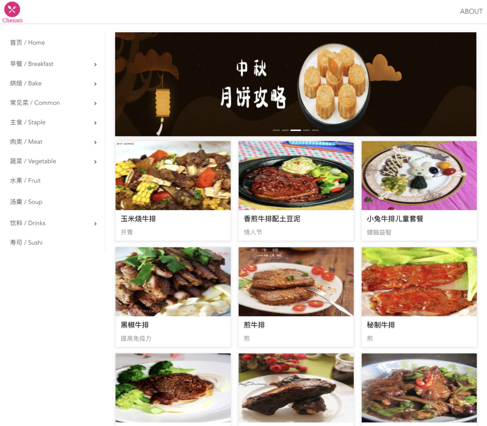
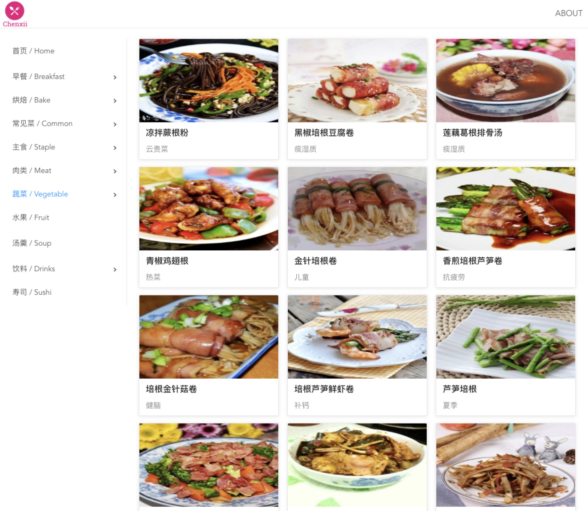
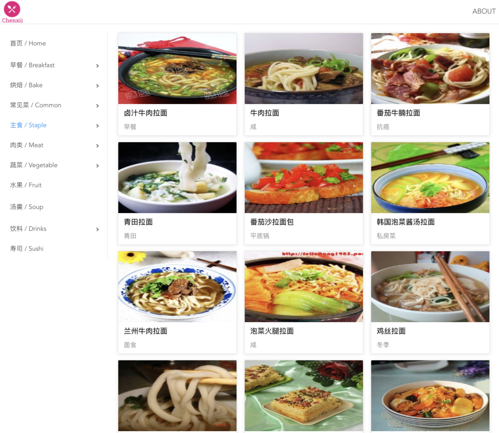
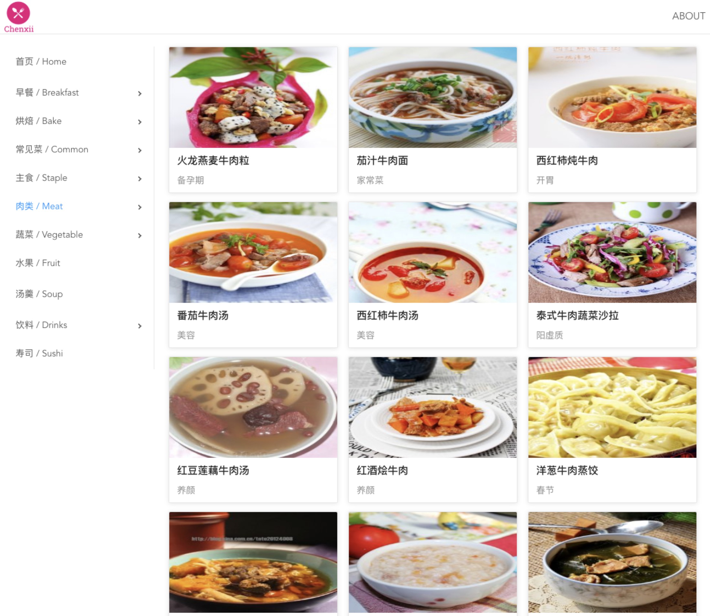

## 🔥💥Cooking Website

> 一个基于 React 全家桶制作的”下厨房“网站项目

[ Cooking | GitHub Page ](https://cooking.chenxii.xyz) | GitHub Page 访问速度快些 | GitHub Page access faster than Heokuro
 
[ Cooking | Heroku ](https://cooking-react.herokuapp.com/) | 因为一小时内若无访问，Heroku后台会自动睡眠，所以访问速度慢些 | Heroku partitions according to resource requirements, if the application has not been accessed for a while, the program stops.

#### Preview | 预览









---

### 技术栈

- React：^16.9.0
- React-router-dom：^5.0.1
- Axios：^0.19.0
- Less：^2.7.3
- Ant Design UI：^3.22.1

---

### 本地运行

```
git clone https://github.com/ChenxiiCheng/React-Cooking.git
cd React-Cooking
npm install  // Or use yarn
npm run start
```
